## Bitahub训练方式及注意事项：

### 1.环境：

`python==3.8	pytorch==1.12`

注意需要安装运行所需的库（可见requirements.txt）：

```txt
torch
torchvision
numpy
tqdm
scipy（上述库bitahub镜像已经存在（可能），可以删去）
tensorboard
tensorboardX
ml-collections
medpy
SimpleITK
h5py
```

##### 安装方式：`pip install -i https://pypi.tuna.tsinghua.edu.cn/simple -r requirements.txt`

### 2.程序修改：

注意在bitahub上（ `linux`  环境）， `DataLoader` 函数中 `num_worker` 可以设置大于 `0` 。

**在 `trainer.py` 中其设置为 8** ，**在 `test.py` 中设置为 1** 。训练时间可以有明显提速（4小时内）。

在 `windows` 环境中，**其均需设置为0**

**应当运行`train.py`和`test_data.py`**

已经在模型文件中保存某次训练的`.pth`文件，可以直接运行`test_data.py`来测试

### 3.TransUnet运行命令：

#### 3.1 训练模型：
`pip install -i https://pypi.tuna.tsinghua.edu.cn/simple -r requirements.txt && python train.py`

#### 3.2 测试模型：
`pip install -i https://pypi.tuna.tsinghua.edu.cn/simple -r requirements.txt && python test_data.py` [注：该方式采用某次训练得到的模型参数文件，只对TransUnet结构有效]

#### 3.3 训练加测试：
`pip install -i https://pypi.tuna.tsinghua.edu.cn/simple -r requirements.txt && python train.py && python test.py` [注：该方式采用训练出的模型参数计算]

### 4.论文中相关研究的实现：

注意，下面只列出对用`args`的参数设置（部分设置为默认参数，可以省去），您需要将其添加在上面命令的`train.py`与`test.py`后。

`pip install -i https://pypi.tuna.tsinghua.edu.cn/simple -r requirements.txt && python train.py [args sets] && python test.py [args sets] `

#### 4.1 Comparison with State-of-arts:

- 参数设置：

  > ViT + None：`--vit_name ViT-B_16 --decoder None`
  >
  > ViT + CUP：`--vit_name ViT-B_16 --n_skip 0`
  >
  > R50-ViT + CUP ：`--vit_name R50-ViT-B_16 --n_skip 0`
  >
  > TransUnet ：`--vit_name R50-ViT-B_16 --n_skip 3` (默认即可)

- *复现结果：*

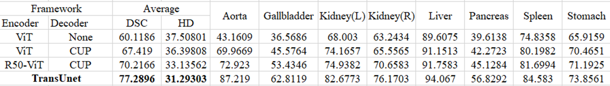

#### 4.2 论文中的结构探究：

受限于个人水平以及预训练模型，部分情况无法实现，只进行了相似的探究。

##### 4.2.1 The number of skip-connections：

- 参数设置：

  > 0-skip(即R50-ViT+CUP)：`--vit_name R50-ViT-B_16 --n_skip 0`
  >
  > 1-skip(1/4分辨率处)：`--decoder Skip1`
  >
  > 1-skip(1/8分辨率处)：`--n_skip 1`
  >
  > 3-skip(即TransUnet)：`--vit_name R50-ViT-B_16 --n_skip 3`

*复现结果：*


##### 4.2.2 On the Influence of Input Resolution：

- 参数设置：

  > 224_resolution：`--img_size 224 `
  >
  > 512_resolution：`--img_size 512 --batch_size 4`

- *复现结果*

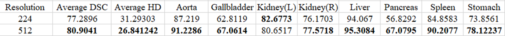

##### 4.2.3 On the Influence of Patch Size/Sequence Length：

由于代码所给的配置中并没有 `Patch_size=8` 以及结合CNN（ResNet50）结构的预训练文件，同时代码中部分设置下的预训练模型参数不匹配。因此只尝试复现了`ViT-B_16`，`ViT-B_32`的情况。与论文中的情况有差别。

- 参数设置

  > patch_size = 16：`--vit_name ViT-B_16 --n_skip 0`
  >
  > patch_size = 32：`--vit_name ViT-B_32 --n_skip 0 --vit_patches_size 32`

- *训练结果*

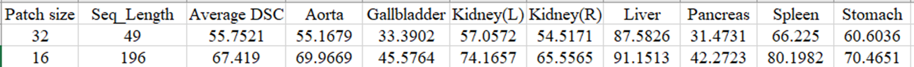

##### 4.2.4 Model Scaling：

论文中对应描述有误，相关参数匹配有错误。实际参数及对应值如下：

| ModelScaling | Hidden size D | Layer num | MLP num | Head num |
| ------------ | ------------- | --------- | ------- | -------- |
| Base         | 768           | 12        | 3072    | 12       |
| Large        | 1024          | 24        | 4096    | 16       |

同样因为2.3所述问题，也只测试了`ViT-B_16`，`ViT-L_16`的情况，与论文有出入。

- 参数设置

  > Base(ViT-B_16)：`--vit_name ViT-B_16 --n_skip 0`
  >
  > Large(ViT-L_16)：`--batch_size 12 --vit_name ViT-L_16 --n_skip 0`

- *训练结果：*


### 5. 对模型的改进：

注意，下面的为对模型的改进尝试，部分改进可以增加模型性能，部分会负优化。所有改进均建立在TransUnet的基础配置上。

同时，**因涉及简单微调，部分改进实现需要手动修改模型文件**。

#### 5.1 改进Decoder中的上采样：

模仿`U-Net`的上采样，将插值转化为卷积。模型在`vit_seg_modeling_new1.py`中实现。

**具体的**：将Decoder过程中的**UpsamplingBilinear2d**替换为**ConvTranspose2d+ReLU**，同时探究了**ReLU**的作用。

- *结构改进：*


- *代码修改：*

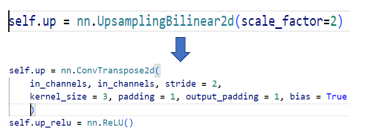

- 参数设置

  > New1：`--decoder NEW1`
  >
  > New1_noReLU：`--decoder NEW1`  [该结构需要手动将模型中的ReLU注释掉，forward中同样]

- *训练结果：*

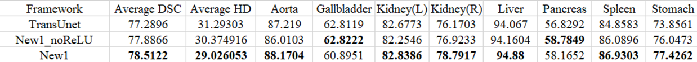

#### 5.2 在Transformer中增加与Decoder的skip-connection：

**具体实现成如图示：**每三层Transformer提取一层信息，并通过reshape等操作将其与每个DecoderBlock的输出结构相同，再与上一层输出连接到一起，并通过上采样输入到下一个DecoderBlock。

新的skip与DecoderBlock的输出连接的方式有两种，一种是使用torch.cat连接；另一种是直接相加。连接之后再上采样，然后**BatchNorm2d**。同时探究了**Batchnorm2d**带来的影响。

- 结构修改及部分代码实现：

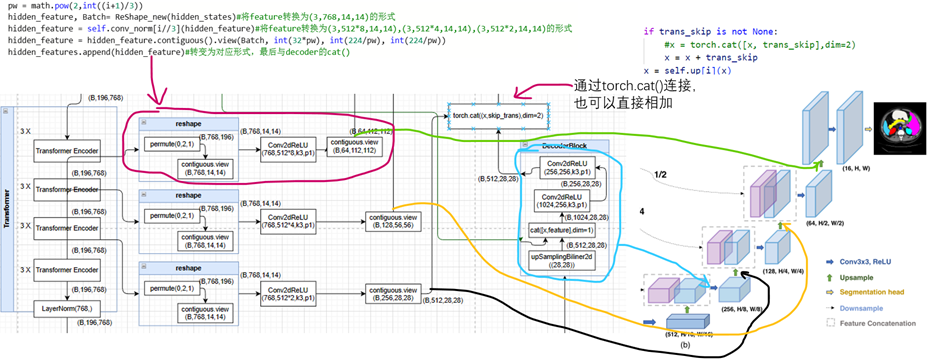

下面对对应结构进行了探究，仿照TransUnet论文对skip-connection的研究进行。

[*注：下表中中后缀**n_skip**代表网络从下到上的连接数，**inPaper**为按照论文中的方式建立的**1-skip**结构*]

##### 5.2.1 使用torch.cat()，再上采样：

- 参数设置：

  [下面的探究需要手动将**DecoderBlock**中的**BatchNorm**操作进行注释]
  
  > New2_3skip：`--decoder NEW --n_skip_trans 3 --con_form Cat`
  >
  > New2_2skip：`--decoder NEW --n_skip_trans 2 --con_form Cat`
  >
  > 1skipinPaper：`--decoder NEW --n_skip_trans 1 --con_form Cat`[该结构需要手动将DecoderCup中的相关代码经行注释]
  >
  > New2_1skip：`--decoder NEW --n_skip_trans 1 --con_form Cat`
  
- *训练结果：*

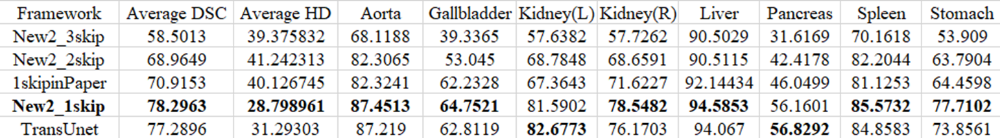

##### 5.2.2 使用torch.cat()，再上采样，然后再BatchNorm：

- 参数设置：

  > 1skipinPaper：`--decoder NEW --n_skip_trans 1 --con_form Cat`[该结构需要手动将DecoderCup中的相关代码经行注释]
  >
  > New2_1skip：`--decoder NEW --n_skip_trans 1 --con_form Cat`

- *训练结果：*

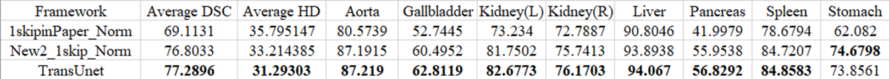

##### 5.2.3 使用tensor相加，再上采样，然后再BatchNorm：

- 参数设置：

  > New3_3skip：`--decoder NEW --n_skip_trans 3 --con_form Add`
  >
  > New3_2skip：`--decoder NEW --n_skip_trans 2 --con_form Add`
  >
  > New3_1skip：`--decoder NEW --n_skip_trans 1 --con_form Add`

- *训练结果：*

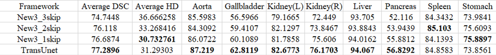

##### 5.2.4 使用tensor相加，再上采样，不进行BatchNorm：

- 参数设置：

  [下面的探究需要手动将**DecoderBlock**中的**BatchNorm**操作进行注释]

  > 1skipinPaper_noNorm：`--decoder NEW --n_skip_trans 1 --con_form Add`[该结构需要手动将DecoderCup中的相关代码经行注释]
  >
  > New3_1skip_noNorm：`--decoder NEW --n_skip_trans 1 --con_form Add`

- *训练结果：*

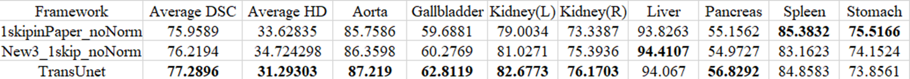

#### 5.3 将上面两者结合实现新的结构：

结合上面的情况，这里只测试了只有1-skip的情况，同时上采样中分为卷积后经过ReLU和不经过ReLU

- 参数设置：

  > 1skipinPaper_noReLU：`--decoder NEW2 --n_skip_trans 1`
  >
  > New4_1skip_noReLU：`--decoder NEW2 --n_skip_trans 1`
  >
  > New4_1skip_ReLU：`--decoder NEW2 --n_skip_trans 1`

- *训练结果：*

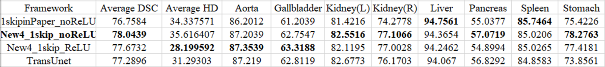
